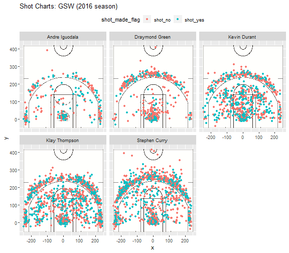

Workout 1
================
Gavril Moniaga

Introduction
------------

The Golden State Warriors are a historic team, having 4 All-Star players and a trajectory to maintain an NBA dynasty. The question arises, then, of who exactly makes this team so dominant, and who contributes most to its ascendancy? Is it Stephen Curry, one of the best point guards in the league? Or Kevin Durant, with his versatility long range to short range? We will examine data in terms of shooting efficiency and shot charts to see how each the Hampton Five (Stephen Curry, Klay Thompson, Kevin Durant, Draymond Green, and Andre Iguodala) makes his mark, specifically in the 2016 season.

Data
----

We have data on each shot taken by each of the five players during the 2016 season, specifically on the type (two point/three point), if the shot scored, where the shot was taken on the court, and when in the game the shot was taken. We will aggregate by each player and examine what percentage of shots taken score points.

Effective Shooting Percentange
------------------------------

To get a picture of the efficacy of each of the Hampton Five on the court, lets take a look at a breakdown of how each player performs on the court, firstly in two point shots:

``` r
twopt <- group_by(filter(data, shot_type=="2PT Field Goal"), name)
twopt <- summarize(twopt, total=length(shot_made_flag), made=sum(shot_made_flag == 'shot_yes'), perc_made = made/total)
twopt <- arrange(twopt,desc(perc_made))
kable(twopt, caption= '2PT Effective Shooting % by Player')
```

| name           |  total|  made|  perc\_made|
|:---------------|------:|-----:|-----------:|
| Andre Iguodala |    210|   134|   0.6380952|
| Kevin Durant   |    643|   390|   0.6065319|
| Stephen Curry  |    563|   304|   0.5399645|
| Klay Thompson  |    640|   329|   0.5140625|
| Draymond Green |    346|   171|   0.4942197|

Surprisingly, we find that Andre Iguodala is the most efficient two-point shooter on the team, and perhaps not so surprisingly, Draymond Green is the least efficient. However, Iguodala takes the least amount of two point shots and significantly less shots than Durant, Curry, and Thompson. This may be due to Iguodala more frequently taking shots when a sure basket is available and playing a supporting role for his teammates. These data aligns with these two players' roles on the court: Iguodala typically plays center and Green is the defensive foundation of the team. As we will see later through shot charts, the location of where these shots are taken has a direct impact on shooting efficiency, and has explanatory power for these statistics.

We also see that despite being considered one of the leagues best point guards, Curry makes little over half the two-point shots he takes, less than his teammate Durant, who is 6% more efficient than him. Durant takes more shots than Curry too, which demonstrates his efficiency may be more closely tied to skill than position on the team.

Let's now look at three point efficiency, where the narrative changes.

``` r
threept <- group_by(filter(data, shot_type=="3PT Field Goal"), name)
threept <- summarize(threept, total=length(shot_made_flag), made=sum(shot_made_flag == 'shot_yes'), perc_made = made/total)
threept <- arrange(threept,desc(perc_made))
kable(threept, caption= '3PT Effective Shooting % by Player')
```

| name           |  total|  made|  perc\_made|
|:---------------|------:|-----:|-----------:|
| Klay Thompson  |    580|   246|   0.4241379|
| Stephen Curry  |    687|   280|   0.4075691|
| Kevin Durant   |    272|   105|   0.3860294|
| Andre Iguodala |    161|    58|   0.3602484|
| Draymond Green |    232|    74|   0.3189655|

Here we can see what gives rise to the name of "Splash Bros". Thompson and Curry both have fairly high efficiency in 3 point shots, with Durant not too far behind. Since Thompson and Curry have similar number of three-point shots taken, we can see that their skill in taking three-pointers is pretty close, and Curry may have a lower percentage simply because he takes more shots. However, the other three players take far fewer 3 point shots, which may be a result of the position that they play in.

Clearly, Thompson and Curry have a critical role in the success of their team offensively, and they have contributed 738 and 840 points respectively over the course of the season in three point shots. Again, we see that Green and Iguodala have a low amount of shots taken, which implies that they don't have a strong influence offensively, or at least in terms of scoring points.

Finally, let's examine data regarding overall scoring efficiency.

``` r
allpts <- group_by(data, name)
allpts <- summarize(allpts, total=length(shot_made_flag), made=sum(shot_made_flag == 'shot_yes'), perc_made = made/total)
allpts <- arrange(allpts,desc(perc_made))
kable(allpts, caption= 'Overall Effective Shooting % by Player')
```

| name           |  total|  made|  perc\_made|
|:---------------|------:|-----:|-----------:|
| Kevin Durant   |    915|   495|   0.5409836|
| Andre Iguodala |    371|   192|   0.5175202|
| Klay Thompson  |   1220|   575|   0.4713115|
| Stephen Curry  |   1250|   584|   0.4672000|
| Draymond Green |    578|   245|   0.4238754|

Clearly, we see that Kevin Durant is the most efficient scorer overall, and this aligns with his role as an offensive arm for the Warriors. However, he doesn't quite take or make as many shots as Thompson or Curry, who are very close in the number of shots taken and scored. Interestingly enough, though we often consider Curry to be the best player on the Warriors, in terms of shooting prowess, Thompson is right up there with him.

Again we see that Iguodala has high shooting effiency, but he shoots about a quarter of the number of shots that Thompson or Curry does, so although he has a high efficiency, it's clear that he plays a more supporting role than an active role, at least on offense.

Overall, at least from shooting efficiency, we find that Kevin Durant is overall the most skilled shooter, although when addressing overall impact, the long range skills of Curry and Thompson contribute the most points and open up space for other close range offensives.

Player Shot Charts
------------------

We can also examine the shot charts of each player to find out how each player performs offensively. Below is a plot of shots taken for each player, with highlighting displaying whether the shot scored or not.


As we can see, the sparsity of Iguodala's shot chart graphically displays what we saw in the tables earlier, that he does not take as many shots as his teammates offensively. There also appears to be a tight cluster of points under the basket for both Green and Iguodala, which suggests that they take more layups than other type of shot.

As consistent with the tables above, we see that both Thompson and Curry have a concentration of shots taken outside the three-point line, and this provides more evidence that the Splash Bros make the greatest impact on offense and total points scored.

Finally we notice Durant has a fairly even spread of shots taken throughout the court, and it appears he takes a lot of mid-range shots. This is consistent with previous data about Durant's skill in two point shots, and in terms of making an impact with the Warriors, he is an offensive weapon with the rate of success on his mid range shots.

Conclusion
----------

Overall, it's not hard to see how these great players synergize with each other: Iguodala and Green play supporting roles on offense, while Curry and Thompson are able to draw out defenders on their long range shots. The fact that Curry and Thompson draw defenders could also allow Iguodala and Green to drive more in the key and mount more effective offensives.

Durant is a mid and close range weapon who is very effective on the inside, and his shot efficency proves his place in not only one of the best of the Warriors, but in the league. He works less with long range shots, but thrives closer to the defenders and the basket, where is height and long reach are assets.

From just these data, we can conclude that Durant, Curry, and Thompson have a profound impact on the offensive strength of the Warriors and create a fierce opponent to play against. However, without more data, we cannot judge who is the best Warrior or even who makes the most difference on the court, but we can see how the different strengths of just these five manifests itself in the team's dominance.
